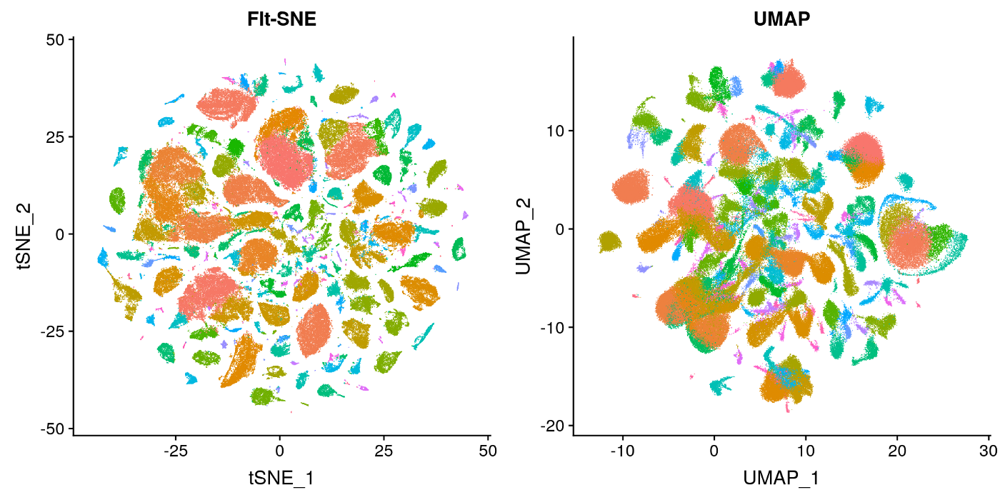

# t-SNE
An implementation of the t-SNE paper for our SMAI course project in Monsoon'21

## Team members
1. Kunal Jain (2019111037)
2. Samay Kothari (2019113017)
3. Aaditya Sharma (2019113009)
4. Adwait Raste (2019111027)

The paper is available [here](./tsne.pdf)

## Problem Statement
Visualization of high-dimensional data is an important problem in many different domains, and deals with data of widely varying dimensionality. The goal of visualizing such data is to give a basic understanding of the distributions and possible properties of the dataset we are dealing with in a format that is easily comprehendable by humans.

A lot of techniques have been developed for this task like UMAP, pixel-based techniques, etc. However, most of the earlier techniques focus on simply displaying the high dimensional data in two dimensions without taking into consideration the interpretability of the generated visualisation to the human. This creates a need for a method to represent the data in an interpretable fashion.

This creates the problem of preserving as much of the significant structure of the high dimensional data as possible in the low dimensional visualisation.

## Goals and Approach
t-Distributed Stochastic Neighbour Embedding(t-SNE) is an unsupervised, non linear technique that is used to do data exploration and visualising high dimensional data. In simpler terms, t-SNE givess us a feel or intuition of how data is arranged in high-dimensional space, using only two or three dimensions. 

Stochastic Neighbor Embedding (SNE) starts by converting the high-dimensional Euclidean distances between datapoints into conditional probabilities that represent similarities.

The t-SNE algorithm calculates a similarity measure between pairs of instances in the high dimensional space and in the low dimensional space. It then tries to optimize these two similarity measures using a cost function.

The similarity of datapoint  to datapoint  is the conditional probability, , that  will pick  as its neighbor if neighbors were picked in proportion to their probability density under a Gaussian centered at , the probability is given by: 

t-SNE can be explained in three major steps:
1. Measure the similarities between points in high dimensional space. Then take a bunch of scattered 2-D points, for each datapoint  we will center a gaussian distribution over that point. Then we measure the density of all the other points  under that gaussian distributions and then renormalize all the points. This gives us a set of probabilities  for all points. These probabilities are propotional to the similarities. All that means is, if data points  and  have equal values under this gaussian circle then their proportions and similarities are equal and hence you have local similarities in the structure of this high-dimensional space. The Gaussian distribution or circle can be manipulated using what’s called perplexity, which influences the variance of the distribution (circle size) and essentially the number of nearest neighbors.
This manipulation of gaussian is done by performing a binary search for the  that produces a  with a fixed perplexity that is specfied by the user. It is mathematically defined as:
, where  is shannon entropy measured in bits: 

2. In second step we do similar thing as we did in first step, but instead of using a gaussian distribution we use t-Distribution with one degree of freedom, which are also called cauchy distribution. This gives us a second probability  which is mathematically given by: 

Where 's are the low dimensional counterparts of 's. It have more heavier tails then normal distribution, so it allows for better modelling of far apart distances.

3. The third step is that we want these probabilities of low dimesional space() to reflect those of high dimensional space() as best as possible. We want the two map structures to be similar. We measure the difference between the probability distributions of the two-dimensional spaces using Kullback-Liebler divergence (KL). We then minmise this KL cost function using gradient descent. Mathematically KL cost function is given by:

where  represents the conditional probability distribution over all other datapoints given datapoint , and  represents the conditional probability distribution over all other map points given map point .

## Dataset
We plan to test our implementation on a number of datasets to ensure generalisability of the technique. We will use the following datasets: 
1. MNIST : This consists of 60,000 grayscale images of handwritten digits. Each image is 28 X 28 = 784 pixels (dimensions).
2. Olivertti faces : This is dataset of 400 images created with 40 indivisuals who change their expressions in the images along with small variations in viewpoint. Each image is 92 X 112 = 10,304 pixes (dimensions) labelled with their identity.
3. COIL-20 : There are 1440 images of 20 objects taken from 72 space orientation (equally spaced). Each image is 32 X 32 = 1,024 pixels (dimensions).
4. Animals10 : There are about 55000 images of animals from 10 classes. Each image is 64 X 64 = 4096 pixels (dimensions)

## Expected Deliverables
t-SNE
## Rough timeline
1. 7 November - 12 November : Paper review
2. 12 November - 17 November : Testing standard implementations of the methond using pre-built libraries on given dataset, test on newer datasets
3. 17 November - 1 December : Implementation of t-SNE and testing with existing implementations

The above timeline is approximate and may change as the project progresses.

## Work distribution
1. Kunal Jain - paper review
2. Samay Kothari - paper review
3. Aaditya Sharma - paper review
4. Adwait Raste - paper review

The above will be updated accordingly as the project progresses.